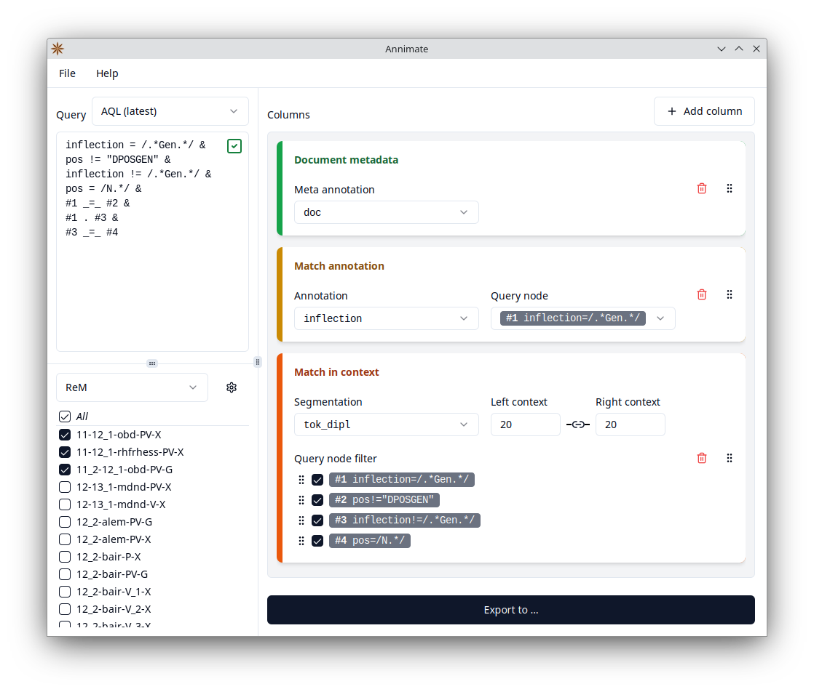

#  Annimate - Your friendly ANNIs MATch Exporter

This is a tool for the convenient export of query results (matches) from the ANNIS[^1] system for linguistic corpora.

It is meant as a supplement to the ANNIS web interface and focuses on file export (as opposed to visualization) of the results of an ANNIS query.

It can currently produce a CSV or an Excel file with one row per match, showing the matched nodes in their context in a KWIC (Keyword in Context) format as well as additional annotations of the matched nodes and metadata on the corpus and document levels. It is similar in functionality to a combination of the ANNIS `TextColumnExporter` and `CSVExporter`, but tries to provide a friendlier user interface.

Annimate is being developed by Matthias Stemmler in cooperation with the [Lehrstuhl für Deutsche Sprachwissenschaft](https://www.uni-augsburg.de/de/fakultaet/philhist/professuren/germanistik/deutsche-sprachwissenschaft/) at the University of Augsburg.

It makes heavy use of the [graphANNIS](https://github.com/korpling/graphANNIS) library by Thomas Krause.



## Download

Annimate is available as a desktop application for Windows and Linux. MacOS is currently not supported. The latest release can be downloaded through the links in the following table. For details on the available formats and installation instructions, see the next section.

| Operating system    | Format         | Installation required? | Automatic updates | Download link                      |
| ------------------- | -------------- | ---------------------- | ----------------- | ---------------------------------- |
| Windows             | Installer      | yes                    | yes               | [Annimate_1.2.0_x64-setup.exe][1]  |
| Linux               | AppImage       | no                     | yes               | [Annimate_1.2.0_amd64.AppImage][2] |
| Linux (Debian only) | Debian package | yes                    | no                | [Annimate_1.2.0_amd64.deb][3]      |

For a list of previous releases, see the [releases page](https://github.com/matthias-stemmler/annimate/releases).

### Windows

Download the installer .exe file (see the table above), run it, and follow the instructions of the installation wizard. Afterwards, you can run Annimate through the Windows start menu and/or the link on the desktop, depending on the options you chose during the installation.

### Linux

You can choose between two formats:

#### AppImage

This comes with all dependencies prebundled, so it is quite large. It can run on any Linux distribution, does not require an installation step and supports automatic updates.

Download the .AppImage file (see the table above), make sure it is marked as executable, and run it.

#### Debian package

This comes without prebundled dependencies, so it is a lot smaller. It can only be installed on Debian-based systems as it relies on the Debian package manager to install the necessary dependencies. Automatic updates are _not_ supported.

Download the .deb file (see the table above) and run the following commands in a shell:

```sh
sudo dpkg -i Annimate_1.2.0_amd64.deb
Annimate
```

## Usage

### Obtaining corpus data

Before you can export query results, you need to import corpus data for one or more corpora into Annimate. The following formats are supported:

- graphANNIS/GraphML (one .graphml file per corpus)
- relANNIS (one folder per corpus)

There are several ways to obtain the corpus data:

- Download the data from a public repository such as [LAUDATIO](https://www.laudatio-repository.org/): Select the `graphannis` or `relannis` download, whichever is available. The downloaded .zip file can be imported directly into Annimate.
- If the corpus is available in a linguistic format different from ANNIS, you may be able to convert it into the relANNIS format using the [Pepper](https://corpus-tools.org/pepper/) conversion tool (select the `ANNISExporter` in the export step).
- If the corpus is accessible through a public installation of ANNIS, ask the maintainers of the installation to provide the data.

### Importing corpus data into Annimate

This needs to be done only once per corpus.

1. In Annimate, click on the  icon to reach the "Manage corpora" screen.
2. Click on "Import corpora", then select whether you want to import a file (for a graphANNIS or ZIP file) or a folder (for a relANNIS corpus or to import multiple corpora from a folder).
3. Select one or more files/folders to import.
4. Wait until the import is finished.
5. At the end of the import procedure and on the "Manage corpora" screen, you can optionally organize your corpora in "corpus sets" in case there are groups of corpora that are often queried together.
6. Afterwards the imported corpora are available for querying.

### Exporting query results

1. On the lower left of the Annimate main screen, select the corpora to query (optionally selecting a corpus set first).
2. On the upper left, enter a query formulated in the [ANNIS Query Language](https://korpling.github.io/ANNIS/4.0/user-guide/aql/index.html) (AQL). Here you can also choose between the current version of AQL and the [compatibility mode](https://korpling.github.io/ANNIS/4.0/user-guide/aql/compatibility-mode.html) with older versions of ANNIS. Once a query is entered, the input field will show whether it is valid.
3. On the right-hand side, configure the desired columns of the CSV/Excel file to produce (for details see below). You can add a new column by clicking on the "Add column" button. The columns can be reordered using drag and drop and removed by clicking on the corresponding button.
4. Select whether you want to produce a CSV file (default) or an Excel file.
5. Click on the "Export to ..." button and select a location for the file. If the button is disabled, this means that the information you entered so far is incomplete.
6. Wait until the export is finished, then click on the "Open folder" or "Open file" links to access the file.

### Types of columns

The following types of columns are available:

1. **Number**

   Sequential number of the match: 1, 2, 3, ...

2. **Corpus/Document metadata**

   Metadata of the corpus or document containing the match.

   "Corpus" here refers to one of the items selected on the lower left. You can select the desired meta annotation from a dropdown. Annis standard annotations are grouped under a separate "Annis" section at the bottom of the list, the others are specific to the selected corpora.

3. **Match annotation**

   An annotation of one of the nodes matched by the query.

   You can select the annotation from a dropdown. Annis standard annotations are grouped under a separate "Annis" section at the bottom of the list, the others are specific to the selected corpora. Note that this contains all available annotations of the selected corpora, even the ones that are also listed as meta annotations for "Corpus metadata" or "Document metadata" columns.

   You also have to select for which node of the query the annotation should be exported, in case the query refers to multiple nodes.

4. **Match in context**

   All nodes matched by the query in their context.

   Note that this usually produces not just one, but multiple columns. These follow a KWIC (Keyword in Context) format, where columns alternate between "match columns" (containing matched nodes) and "context columns" (containing other nodes that are not matched by the query, but are part of the context of the matched nodes).

   In case the selected corpora contain multiple different segmentations (ways of segmenting the text into nodes), you can select the desired segmentation in a dropdown. Note that this only contains segmentations that are available in _all_ of the selected corpora.

   You can select the size of the context (measured in segmentation nodes). By default, the left and right context inputs are linked together and change at the same time. To set them independently, click on the chain icon between them.

   In some cases, there may be nodes that are matched by the query, but should not be treated as matched nodes for the purpose of the export. In this case, you can remove the corresponding checkmark under "Query node filter". For instance, when querying for tokens that are part of a sentence, you may want to treat the rest of the sentence as context rather than as a match, even though the sentence node may be matched by the query. Note that the context size still refers to _all_ of the query nodes.

   The nodes that are activated under "Query node filter" can be reordered to define a priority between them. This becomes relevant when several of them cover overlapping parts of the text: In this case, tokens that are part of the overlapping region are treated as being part of the query node that is higher up in the priority order.

## Changelog

See [CHANGELOG.md](CHANGELOG.md)

## License

Licensed under the Apache License, Version 2.0 (see [LICENSE](LICENSE) or https://www.apache.org/licenses/LICENSE-2.0)

[1]: https://github.com/matthias-stemmler/annimate/releases/download/v1.2.0/Annimate_1.2.0_x64-setup.exe
[2]: https://github.com/matthias-stemmler/annimate/releases/download/v1.2.0/Annimate_1.2.0_amd64.AppImage
[3]: https://github.com/matthias-stemmler/annimate/releases/download/v1.2.0/Annimate_1.2.0_amd64.deb

[^1]:
    **Krause, Thomas & Zeldes, Amir** (2016):
    _ANNIS3: A new architecture for generic corpus query and visualization._
    in: Digital Scholarship in the Humanities 2016 (31).
    <https://dsh.oxfordjournals.org/content/31/1/118>
