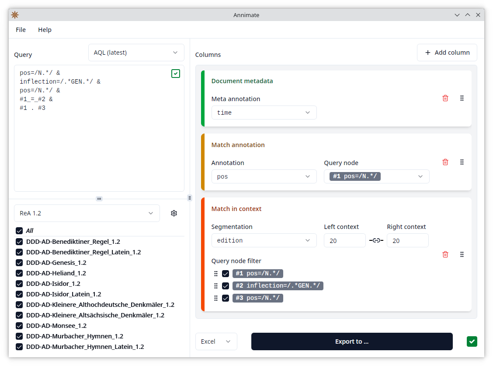

#  Annimate - Your Friendly ANNIS Match Exporter

This is a tool for the convenient export of query results (matches) from the [ANNIS](https://corpus-tools.org/annis/)[^1] system for linguistic corpora.

It is meant as a supplement to the ANNIS web interface and focuses on file export (as opposed to visualization) of the results of an ANNIS query.

> [!NOTE]
> Annimate is being developed by [Matthias Stemmler](https://github.com/matthias-stemmler) in cooperation with the [Lehrstuhl für Deutsche Sprachwissenschaft](https://www.uni-augsburg.de/de/fakultaet/philhist/professuren/germanistik/deutsche-sprachwissenschaft/) at the University of Augsburg.
>
> It is based on the [graphANNIS](https://corpus-tools.org/graphannis/) library by Thomas Krause.

Annimate can produce a CSV or an Excel file with one row per match, showing the matched nodes in their context in a KWIC (Key Word in Context) format as well as additional annotations of the matched nodes and metadata on the corpus and document levels. It is similar in functionality to a combination of the ANNIS `TextColumnExporter` and `CSVExporter`, but provides a friendlier user interface.

## User Guide

For a detailed explanation of how to work with Annimate, see the [User Guide](https://matthias-stemmler.github.io/annimate/user-guide/).

## Download

Annimate is available as a desktop application for Windows, Linux and macOS. The latest release can be downloaded through the links in the following table.

> [!IMPORTANT]
> Please read the [Installation](https://matthias-stemmler.github.io/annimate/user-guide/installation.html) section of the User Guide before installing, especially on macOS.

| Operating system | Format         | Installation required? | Automatic updates | Download link                      |
| ---------------- | -------------- | ---------------------- | ----------------- | ---------------------------------- |
| Windows          | Installer      | ✅                     | ✅                | [Annimate_1.5.0_x64-setup.exe][1]  |
| Linux            | AppImage       | ❌                     | ✅                | [Annimate_1.5.0_amd64.AppImage][2] |
| Linux            | Debian package | ✅                     | ❌                | [Annimate_1.5.0_amd64.deb][3]      |
| macOS (silicon)  | App Bundle     | ✅                     | ✅                | [Annimate_aarch64.app.tar.gz][4]   |
| macOS (Intel)    | App Bundle     | ✅                     | ✅                | [Annimate_x64.app.tar.gz][5]       |

For a list of previous releases, see the [releases page](https://github.com/matthias-stemmler/annimate/releases).

## Feedback

If you have any kind of feedback on Annimate such as a bug report, documentation issue or idea for a new feature, please [create an issue](https://github.com/matthias-stemmler/annimate/issues/new/choose).

## Changelog

See [CHANGELOG.md](CHANGELOG.md)

## Publication

61\. Jahrestagung des Leibniz-Instituts für Deutsche Sprache "Deutsch im Wandel", [Methodenmesse](https://www.ids-mannheim.de/aktuell/veranstaltungen/tagungen/2025/methodenmesse/) am 12. März 2025, Congress Center Rosengarten Mannheim: [Poster](docs/readme/documents/2025-ids-methodenmesse-poster.pdf), [Abstract](https://www.ids-mannheim.de/fileadmin/aktuell/Jahrestagungen/2025/Methodenmesse/3_Annimate.pdf) (in German)

## License

Licensed under the Apache License, Version 2.0 (see [LICENSE](LICENSE) or https://www.apache.org/licenses/LICENSE-2.0)

[1]: https://github.com/matthias-stemmler/annimate/releases/download/v1.5.0/Annimate_1.5.0_x64-setup.exe
[2]: https://github.com/matthias-stemmler/annimate/releases/download/v1.5.0/Annimate_1.5.0_amd64.AppImage
[3]: https://github.com/matthias-stemmler/annimate/releases/download/v1.5.0/Annimate_1.5.0_amd64.deb
[4]: https://github.com/matthias-stemmler/annimate/releases/download/v1.5.0/Annimate_aarch64.app.tar.gz
[5]: https://github.com/matthias-stemmler/annimate/releases/download/v1.5.0/Annimate_x64.app.tar.gz

[^1]:
    **Krause, Thomas & Zeldes, Amir** (2016):
    _ANNIS3: A new architecture for generic corpus query and visualization._
    in: Digital Scholarship in the Humanities 2016 (31).
    <https://dsh.oxfordjournals.org/content/31/1/118>
