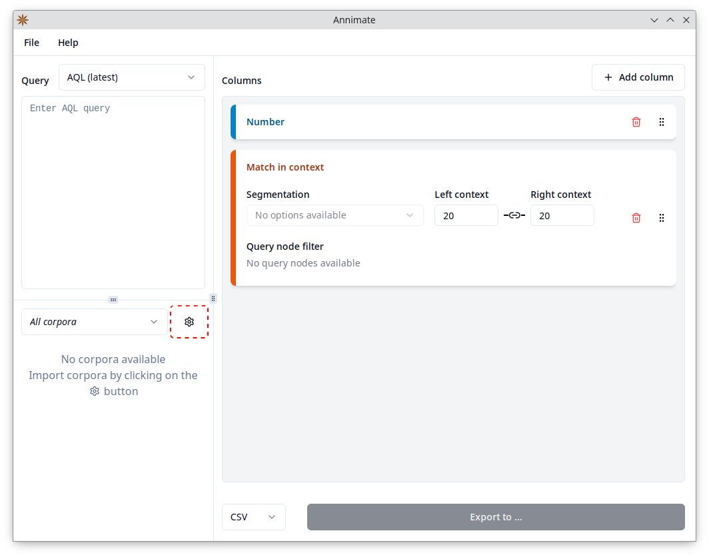

# Importing Corpus Data

Before you can run a query and export its results, you need to obtain corpus data for one or more corpora and import them into your installation of Annimate.

Note that there are different definitions of what constitutes a corpus, depending on the context. For instance, the _Referenzkorpus Altdeutsch (ReA) 1.2_ consists of several parts:

```
ReA
├─ DDD-AD-Benediktiner_Regel_1.2
├─ DDD-AD-Benediktiner_Regel_Latein_1.2
├─ DDD-AD-Genesis_1.2
├─ DDD-AD-Heliand_1.2
├─ DDD-AD-Isidor_1.2
   ...
```

While one would commonly call the full ReA a corpus, it's each individual part such as `DDD-AD-Benediktiner_Regel_1.2` that's called a _corpus_ in the context of ANNIS and Annimate.

### Obtaining Corpus Data

Corpora are distributed in many different data formats, two of which a related to ANNIS and are supported by Annimate:

- **graphANNIS/GraphML**: This is the graph-based format used internally by ANNIS. In this format, each corpus comes as a single `.graphml` file.
- **relANNIS**: This is the relational format that was previously used by ANNIS but is still used to distribute many corpora. In this format, each corpus comes as a folder containing multiple files with fixed names such as `corpus.tab` or `node.tab`.

Annimate can import corpora in both of these formats, either directly or as a ZIP file containing the data in either format.

There are several ways to obtain the corpus data:
- Download the data from a public repository such as [LAUDATIO](https://www.laudatio-repository.org/): In the "Download" menu for each corpus (here in the sense of a full corpus such as ReA), you find a list of the formats in which the data are available. Select `graphannis` or `relannis` if available. The downloaded ZIP file can be imported directly into Annimate.
- If the corpus is available in a linguistic format different from graphANNIS or relANNIS, you may be able to convert it into one of the two supported formats using a conversion tool such as [Pepper](https://corpus-tools.org/pepper/) or [Annatto](https://github.com/korpling/annatto):
  - For Pepper, select the [`ANNISExporter`](https://github.com/korpling/pepperModules-ANNISModules/tree/master#usage) in the export step to convert the corpus into the relANNIS format.
  - For Annatto, use the [`graphml`](https://github.com/korpling/annatto/blob/main/docs/exporters/graphml.md) exporter to convert the corpus into the graphANNIS/GraphML format.
- If the corpus is accessible through a public installation of ANNIS, ask the maintainers of the installation to provide the data.

### Importing Into Annimate

1. In Annimate, click on the  button to reach the "Manage corpora" screen.
   