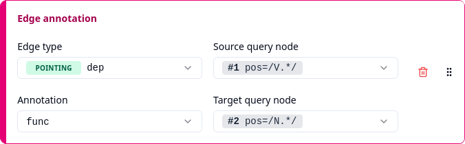

# Edge annotation



ANNIS corpora consist of nodes as well as _edges_ (arrows) between these nodes. Both nodes and edges can have annotations, and an "Edge annotation" column is used for exporting an annotation of an edge between two of the nodes matched by a query.

> **Note:** The ReA corpus used as an example in the rest of this User Guide does not contain any edge annotations, which is why this section gives examples using the [GUM](https://gucorpling.org/gum/) corpus instead.

There are different kinds of edges, two of which can come with annotations:

- _Dominance_ edges for hierarchical structures, see [Searching for Trees](https://korpling.github.io/ANNIS/4/user-guide/aql/trees.html)
- _Pointing_ edges for arbitrary directed relationships, see [Searching for Pointing Relations](https://korpling.github.io/ANNIS/4/user-guide/aql/pointing.html)

For instance, the query

```
pos=/V.*/ ->dep[func=/i?obj/] pos=/N.*/
```

searches for a verb that has a pointing relationship of type `dep` to a noun, where the pointing edge between the two nodes has a `func` annotation with value `obj` (direct object) or `iobj` (indirect object).

With an "Edge annotation" column, you can export the value of the `func` annotation on the pointing edge to tell whether it has the value `obj` or `iobj`.

First you need to select an _edge type_, which is either `Dominance` or `Pointing` together with a name to distinguish between different types of dominance or pointing edges. In the example, this would be `Pointing`/`dep` to select pointing edges of type `dep`. Note that pointing edges always have a name, while for dominance edges, the name may be empty. In fact, corpora with dominance edges typically have a dominance edge type with an empty name that just represents "dominance of _any_ type".

The list under "Edge type" contains all edge types that are present in _any_ of the selected corpora. It only shows edge types for which there is at least one annotation. If the list is empty, this means that none of the selected corpora contains any (dominance or pointing) edges with annotations.

After you have selected an edge type, the list under "Annotation" will show all annotations that are available for the selected edge type in _any_ of the selected corpora. Like for "Match annotation", annotations are shown together with their namespaces if this is necessary for disambiguation, and otherwise they are just shown with their names (see [Match annotation](match-annotation.md) for details).

Under "Source query node" and "Target query node", you need to select which of the query nodes is the source and which is the target of the edge to export. Note that only edges that go directly from the source node to the target node are considered. Hence, when you search for _chains_ of edges with operators such as `>*` or `->dep*`, the exported column will be empty unless the chain happens to be of length one, representing a direct edge.
