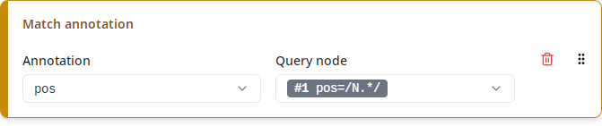

# Match annotation



This produces a single column containing a particular annotation of one of the matched nodes. For instance, in the query

```
pos=/N.*/ &
inflection=/.*GEN.*/ &
pos=/N.*/ &
#1_=_#2 &
#3 . #2
```

the query node `#1` is required to have a `pos` annotation with a value starting with `N`, but the exact value may vary. A "Match annotation" column helps you export this exact value. Under "Annotation", you can select which annotation to export (`pos` in the example), and under "Query node", you can select the query node for which you want to export the annotation (`#1 pos=/N.*/` in the example).

The list under "Annotation" contains all annotations that are present in _any_ of the selected corpora. If a match is contained in a corpus that doesn't have the selected annotation, the column will be empty for that match. The same happens if the corpus does have the annotation, but the matched node doesn't have a value for it.

You may notice that the list also contains "meta" annotations, i.e. annotations that refer to a document within the corpus or the entire corpus. This is because queries may not just refer to nodes that cover tokens of the text, but also to corpus or document nodes. If you want to export metadata on a corpus or document level regardless of whether the query refers to those nodes, use a "Corpus metadata" or "Document metadata" column instead, as described under [Corpus/document metadata](metadata.md).

It may happen that a corpus contains multiple different annotations of the same name. For this case, ANNIS uses _namespaces_ to disambiguate the annotations. In a query, an annotation can be referred to as `namespace:name` if necessary, or just `name` if the name is unique. The namespace can also be empty, in which case the annotation would always be referred to just by its name. For instance, in ReA there are two annotations called `text`, one under the `default_ns` namespace and one under the empty namespace. In the list under "Annotation", you would find these as `default_ns:text` and `text`, respectively. In general, the list shows the namespace if necessary to disambiguate and omits it if the name is already unique (or the namespace is empty).

There is a special namespace called `annis` containing annotations whose meaning is defined by the ANNIS standard, as opposed to annotations whose meaning is defined by the particular corpora you're querying. In order to make this distinction clear, the ANNIS standard annotations are shown at the end of the list under the "ANNIS" label. These annotations are mainly listed for completeness and will not be needed in most cases.

Note that strictly speaking, the selected annotation does not have to be exactly on the selected node in order to be exported. Consider the above example again:

```
pos=/N.*/ &
inflection=/.*GEN.*/ &
pos=/N.*/ &
#1_=_#2 &
#3 . #2
```

In a match for this query, the nodes matched by `#1` and `#2` are never the same, because ReA uses distinct nodes for the `pos` and `inflection` annotations. The condition `#1_=_#2` just requires the two nodes to cover the same tokens, as opposed to `#1 _ident_ #2`, which would require them to be exactly the same node (and hence would yield no matches). However, if you configure a "Match annotation" column to export the `inflection` annotation of `#1 pos=/N.*/`, you still get a value. This is because in case the selected node doesn't have the selected annotation, Annimate looks for the first node that satisfies these two conditions:

- Its token coverage overlaps with that of the selected node (`#1`), and
- it has a value for the selected annotation (`inflection`).

Of course, in the example you can achieve the same by just selecting the query node `#2 inflection=/.*GEN.*/` instead, but it is especially useful when you want to export an annotation that is not mentioned explicitly in the query. For instance, say you want to export the `lemma` annotation of the genitive node. Then you can select `lemma` and either `#1 pos=/N.*/` or `#2 inflection=/.*GEN.*/` and you will get a result despite the fact that neither of the two matched nodes actually has a value for `lemma`. This is because there is another node which is not mentioned in the query, whose token coverage overlaps (in fact, coincides with) that of `#1` and `#2` and which has a value for `lemma`.

Note that when your query is an "or" query with multiple alternatives, for technical reasons Annimate doesn't know which of the alternatives actually applied for any particular match. This is why the list under "Query node" may show multiple nodes grouped in one entry. For instance, for the query

```
pos=/N.*/ | pos=/V.*/
```

you will just see a single entry showing `#1 pos=/N.*/` and `#2 pos=/V.*/` next to each other. The export for each match will then contain the selected annotation either for `#1` or for `#2`, depending on which alternative applied for that particular match.

Similarly, when the query contains optional nodes followed by other (optional or non-optional) nodes, those following nodes appear in multiple entries under "Query node". For instance, say you want to restrict the above query to cases where the match is not preceded by an adjective:

```
pos=/ADJ.*/? &
pos=/N.*/ &
inflection=/.*GEN.*/ &
pos=/N.*/ &
#1!. #4 &
#2_=_#3 &
#4 . #3
```

Now the query node `#2 pos=/N.*/` can either be the first or the second node of any particular match, depending on whether the optional node `#1 pos=/ADJ.*/?` is present or not. In this case, you would have to select _all_ entries containing `#2` in order to make sure that the export always includes the selected annotation for `#2`. However, you can avoid this problem at least for non-optional nodes by putting optional nodes at the end of the query:

```
pos=/N.*/ &
inflection=/.*GEN.*/ &
pos=/N.*/ &
pos=/ADJ.*/? &
#1_=_#2 &
#3 . #2 &
#4!. #3
```

Now the position of each non-optional node is unique, because there is no optional node before it.
