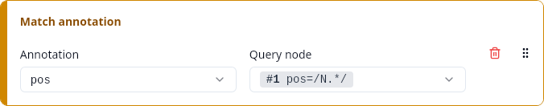

# Match annotation



This produces a single column containing a particular annotation of one of the matched nodes. For instance, in the query

```
pos=/N.*/ &
inflection=/.*GEN.*/ &
pos=/N.*/ &
#1_=_#2 &
#1 . #3
```

the query node `#1` is required to have a `pos` annotation with a value starting with `N`, but the exact value may vary. A "Match annotation" column helps you export this exact value. Under "Annotation", you can select which annotation to export (`pos` in the example), and under "Query node", you can select the query node for which you want to export the annotation (`#1 pos=/N.*/` in the example).

The list under "Annotation" contains all annotations that are present in _any_ of the selected corpora. If a match is contained in a corpus that doesn't have the selected annotation, the column will be empty for that match. The same happens if the corpus does have the annotation, but the matched node doesn't have a value for it.

You may notice that the list also contains "meta" annotations, i.e. annotations that refer to a document within the corpus or the entire corpus. This is because queries may not just refer to nodes that cover tokens of the text, but also to corpus or document nodes. If you want to export metadata on a corpus or document level regardless of whether the query refers to those nodes, use a "Corpus metadata" or "Document metadata" column instead, as described under [Corpus/document metadata](metadata.md).

It may happen that a corpus contains multiple different annotations of the same name. For this case, ANNIS uses _namespaces_ to disambiguate the annotations. In a query, an annotation can be referred to as `namespace:name` if necessary, or just `name` if the name is unique. The namespace can also be empty, in which case the annotation would always be referred to just by its name. For instance, in ReA there are two annotations called `text`, one under the `default_ns` namespace and one under the empty namespace. In the list under "Annotation", you would find these as `default_ns:text` and `text`, respectively. In general, the list shows the namespace if necessary to disambiguate and omits it if the name is already unique (or the namespace is empty).

There is a special namespace called `annis` containing annotations whose meaning is defined by the ANNIS standard, as opposed to annotations whose meaning is defined by the particular corpora you're querying. In order to make this distinction clear, the ANNIS standard annotations are shown at the end of the list under the "ANNIS" label. These annotations are mainly listed for completeness and will not be needed in most cases.

Note that strictly speaking, the selected annotation does not have to be exactly on the selected node in order to be exported. Consider the above example again:

```
pos=/N.*/ &
inflection=/.*GEN.*/ &
pos=/N.*/ &
#1_=_#2 &
#1 . #3
```

In a match for this query, the nodes matched by `#1` and `#2` are never the same, because ReA uses distinct nodes for the `pos` and `inflection` annotations. The condition `#1_=_#2` just requires the two nodes to cover the same tokens, as opposed to `#1 _ident_ #2`, which would require them to be exactly the same node (and hence would yield no matches). However, if you configure a "Match annotation" column to export the `inflection` annotation of `#1 pos=/N.*/`, you still get a value. This is because in case the selected node doesn't have the selected annotation, Annimate looks for the first node that satisfies these two conditions:

- Its token coverage overlaps with that of the selected node (`#1`), and
- it has a value for the selected annotation (`inflection`).

Of course, in the example you can achieve the same by just selecting the query node `#2 inflection=/.*GEN.*/` instead, but it is especially useful when you want to export an annotation that is not mentioned explicitly in the query. For instance, say you want to export the `lemma` annotation of the genitive node. Then you can select `lemma` and either `#1 pos=/N.*/` or `#2 inflection=/.*GEN.*/` and you will get a result despite the fact that neither of the two matched nodes actually has a value for `lemma`. This is because there is another node which is not mentioned in the query, whose token coverage overlaps (in fact, coincides with) that of `#1` and `#2` and which has a value for `lemma`.

Note that when your query is an "or" query with multiple alternatives, the list under "Query node" may show multiple nodes grouped in one entry. This is because a column is configured once for the entire export, while which alternative applies may differ from one match to another. For instance, for the query

```
pos=/N.*/ | pos=/V.*/
```

you will just see a single entry showing `#1 pos=/N.*/` and `#2 pos=/V.*/` next to each other. The export for each match will then contain the selected annotation either for `#1` or for `#2`, depending on which alternative applied for that particular match.

There may be cases where, instead of exporting an annotation of the selected node, you want to know directly which of the nodes shown next to each other actually applied for a particular match. To support this, the list under "Annotation" contains two additional entries at the end, shown under the "Query node" label: _Fragment_ and _Variable_. Unlike the other entries, these do not depend on the corpus data, so they are available for any selection of corpora, as long as the list contains at least one annotation. When you select _Fragment_, the column will contain the fragment of the query applying to the selected node. In the example above, this would be either `pos=/N.*/` or `pos=/V.*/`, depending on which alternative applied. When you select _Variable_, the column will contain the corresponding variable name, for example `1` or `2`.

Note that the AQL syntax allows you to use your own variable names rather than the numerical variable names `1`, `2`, etc. that are assigned automatically. For instance, for the query

```
noun#pos=/N.*/ | verb#pos=/V.*/
```

the variable name would be `noun` or `verb`, depending on the alternative.

Finally, note that not every entry under "Query node" has a node in every alternative. For instance, for the query

```
pos=/N.*/ | pos=/V.*/ . pos=/A.*/
```

the list shows a first entry with `#1 pos=/N.*/` and `#2 pos=/V.*/` next to each other, but a second entry with only `#3 pos=/A.*/`, which is part of the second alternative alone. Whenever the first alternative applies for a match, a column referring to that second entry will be empty. This is true for annotations as well as for _Fragment_ and _Variable_.
