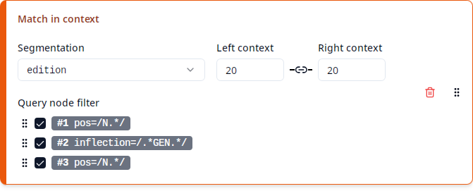

# Match in context



This produces multiple columns showing each match within its context in the corpus, in a format which is known as [_Key Word in Context_](https://en.wikipedia.org/wiki/Key_Word_in_Context) or _KWIC_. Each match may consist of multiple _nodes_, which correspond to the nodes of the query referenced by the variables `#1`, `#2`, etc. For instance, the query

```
pos=/N.*/ &
inflection=/.*GEN.*/ &
pos=/N.*/ &
#1_=_#2 &
#3 . #2
```

consists of three nodes referenced by the variables `#1`, `#2` and `#3`, so each match also consists of three nodes. As queries can be "or" queries with multiple alternatives, the number of nodes may vary from one match to another. The exact number of columns in the export depends on the maximal number of nodes contained in any match. In the simplest case, if the query contains only a single node (referred to as `#1`), every match also contains a single node and the export will contain three columns:

| Left context | Match | Right context |
| ------------ | ----- | ------------- |

If the query contains two nodes (referred to as `#1` and `#2`), the export will contain five columns:

| Context 1 | Match 1 | Context 2 | Match 2 | Context 3 |
| --------- | ------- | --------- | ------- | --------- |

And so on. Note that [optional nodes](https://korpling.github.io/ANNIS/4/user-guide/aql/negation.html#negation-without-the-assumption-of-existence) are not included in the export.

A corpus may define several different _segmentation layers_ (or _segmentations_ for short), which define how the text is split up into nodes. The most fine-grained segmentation layer is called the _token layer_. This layer is always present and each node on any segmentation layer spans one or more of these tokens. For instance, the ReA corpus contains the `edition` and `text` layers besides the token layer.

Under "Segmentation", you can select the segmentation layer to be used for the "Match in context" columns. This list only contains segmentations that exist in _all_ of the selected corpora. Since one typically runs a query over a set of corpora with a similar annotation structure (for instance all corpora of ReA), the list should be as expected. If you're missing a segmentation, check if any of your selected corpora may be structured differently from the others, e.g. by checking if the desired segmentation appears when just a single corpus is selected.

> **Note:** In corpora with multiple segmentation layers, the token layer is often _only_ used to align the different segmentations (i.e. define which segmentation nodes on the different layers span the same parts of the text), but doesn't have any textual content itself. In the case of these _virtual tokens_, you need to select a segmentation different from _Tokens (default)_ or else the "Match in context" columns will be empty.

Under "Left context" and "Right context" you can define how many segmentation nodes to the left respectively right of any match node should be included as context. You can enter any number from `0` to `999` inclusive. Since it is very common to use the same size for the left and right contexts, by default changing one of the two numbers will automatically set the other to the same value. In order to turn off this behavior, enabling you to set the left and right context sizes independently, click on the "link" icon between the two.

> **Note:** Some corpora contain non-standard segmentations where the context size cannot be measured in segmentation nodes for technical reasons. In such cases, context size will be measured in tokens instead. This can lead to smaller context windows than expected. In this case, just increase the context size as needed. The textual content of the "Match in context" columns will still be according to the selected segmentation in any case.

Note that setting very small context sizes can lead to "gaps" in the export in case a match consists of two nodes that are so far apart that their context windows don't overlap. In this case the gap is marked as `(...)` in the respective context column in the export. If both context sizes are set to zero, the export will not contain any context columns at all (unless you use the query node filter, see below).

There is a special case in which you may want to treat a node matched by the query as part of the context rather than as a match: Some corpora contain annotations for larger spans such as clauses, which you may want to use as auxiliary nodes to express conditions on the nodes you are actually looking for. For instance, suppose we want to restrict the above query to matches contained within interrogative clauses:

```
pos=/N.*/ &
inflection=/.*GEN.*/ &
pos=/N.*/ &
clause=/.*_Int/ &
#1_=_#2 &
#3 . #2 &
#4_i_#1 &
#4_i_#3
```

Now the query contains four nodes, referred to as `#1`, `#2`, `#3` and `#4`, which by default would all count as match nodes and would thus be included in a "Match" column. However, since one of the nodes, `#4`, represents the clause, this would include the entire clause in a "Match" column, hiding the information which nodes are actually matched by `#1`, `#2` and `#3`. One could say that `#4` is just an auxiliary node whose sole purpose is to express a condition on `#1` and `#3`, namely that those are included in a clause with a certain property. In order to avoid treating `#4` as a match node, you can use the "Query node filter" that defines which query nodes count as a match: Just click on the checkbox next to `#4` to exclude it from the filter. Nodes that are part of the clause `#4`, but aren't part of `#1`, `#2` or `#3`, will now be treated as being part of the context.

> **Note:** The left/right context size still refers to the context around _all_ query nodes, not just the ones included in the query node filter.

In case the query node filter includes multiple nodes that may overlap, you can reorder the checked nodes by clicking on the  button of an entry and then dragging it up or down. This defines a priority order between the nodes, so that when a segmentation node is part of multiple query nodes, it will be treated as being part of the first one according to the priority. Changing this priority order should not be necessary in most cases.
