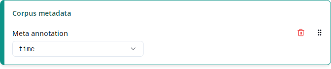
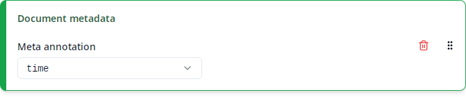

# Corpus/document metadata





ANNIS corpora are subdivided into _documents_, which in turn contain the text nodes that you would typically search for. For example, the corpus/document structure of ReA looks like this:

```
ReA 1.2
├─ DDD-AD-Benediktiner_Regel_1.2
│  ├─ B_0
│  ├─ B_1
│     ...
├─ DDD-AD-Genesis_1.2
│  ├─ Gen_1
│  ├─ Gen_2
│     ...
├─ DDD-AD-Kleinere_Althochdeutsche_Denkmäler_1.2
│  ├─ AB_AltbairischeBeichte
│  ├─ AGB_AlemGlaubenundBeichte
│     ...
├─ DDD-AD-Kleinere_Altsächsische_Denkmäler_1.2
│  ├─ AN_AbecedariumNordmannicum
│  ├─ ASB_Altsaechsische_Beichte
      ...
```

Here, the items directly below `ReA 1.2` such as `DDD-AD-Benediktiner_Regel_1.2` are the _corpora_ and the items below those such as `B_0` are the _documents_.

Just like normal text nodes, corpus and document nodes can also have annotations. These are called _meta annotations_ because they usually contain metadata about a corpus or document such as `dialect`, `time` or `topic`. It depends on the corpus which meta annotations are present at the corpus or document levels.

The "Corpus metadata" respectively "Document metadata" columns contain the value of the selected meta annotation for the corpus respectively document that each match is contained in.

The list under "Meta annotation" contains all meta annotations that are present in _any_ of the selected corpora at the corpus or document levels, respectively. Like for "Match annotation", annotations are disambiguated by showing their namespaces if necessary and ANNIS standard annotations are shown at the end under the "ANNIS" label (see [Match annotation](match-annotation.md) for details). For documents, the ANNIS standard annotation `doc` (or `annis:doc`) contains the document name such as `AB_AltbairischeBeichte`. As this annotation is always present for documents (in fact, the presence of this annotation is what technically _defines_ a document), it is especially useful in cases where there's no corpus-specific annotation containing the document name. For ReA, you may want to use the `text` annotation instead.

> **Note:** It may happen that the same meta annotation can be found at the corpus level for some corpora, but at the document level for others. In ReA, for instance, annotations such as `dialect`, `time` or `topic` are usually maintained at the corpus level, except for the two corpora `DDD-AD-Kleinere_Althochdeutsche_Denkmäler_1.2` and `DDD-AD-Kleinere_Altsächsische_Denkmäler_1.2`, where they are maintained for each individual document. This is because these two corpora are heterogeneous collections of documents with different values for those meta annotations, while the other corpora are more homogeneous, so the meta annotations can be maintained at the corpus level. You may want to add both a "Corpus metadata" and a "Document metadata" column for the same annotation in order to make sure that your export covers both cases.
