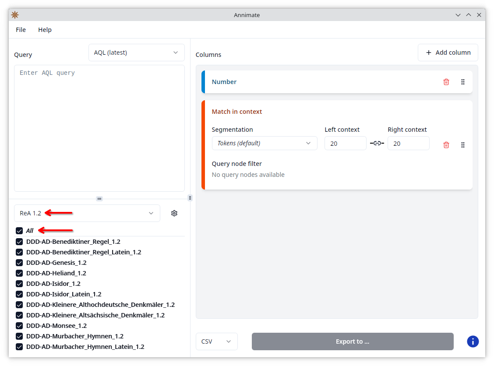
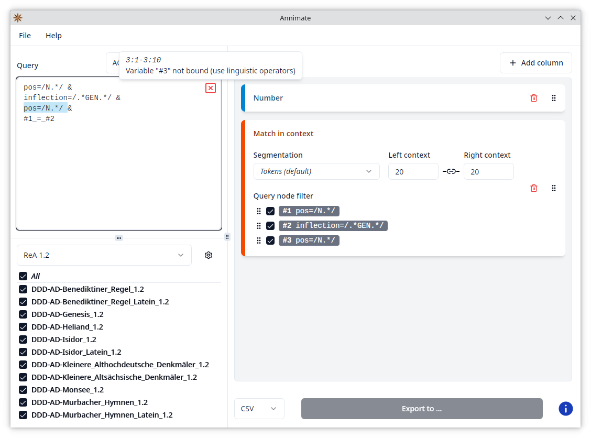
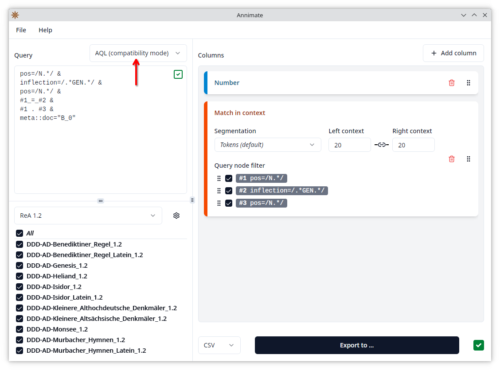
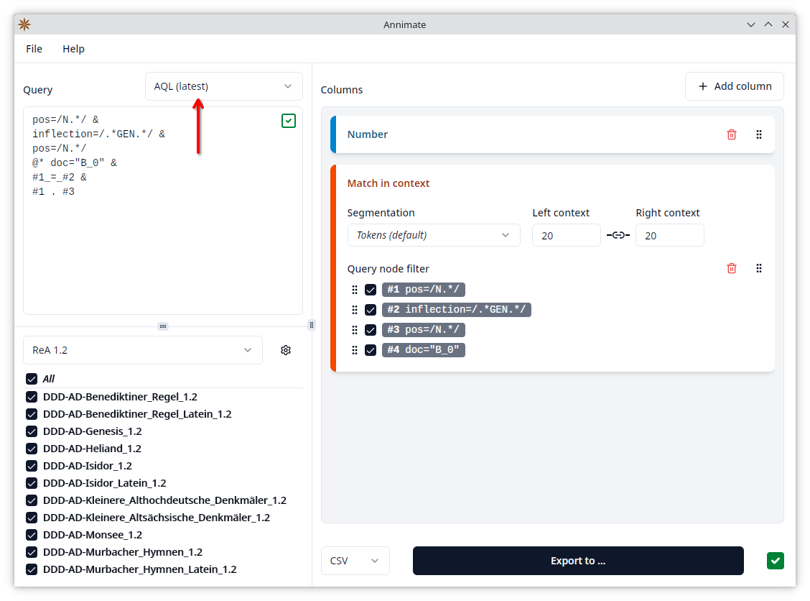
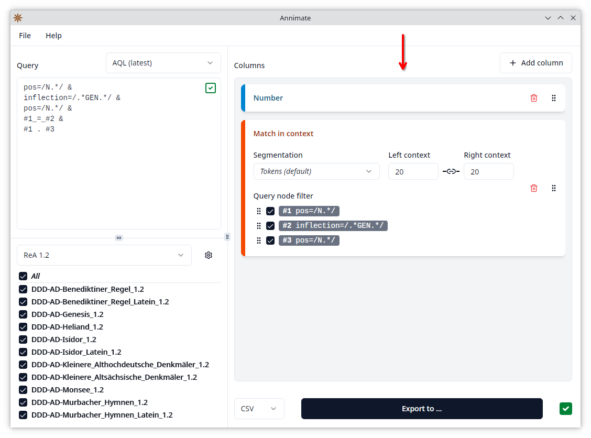
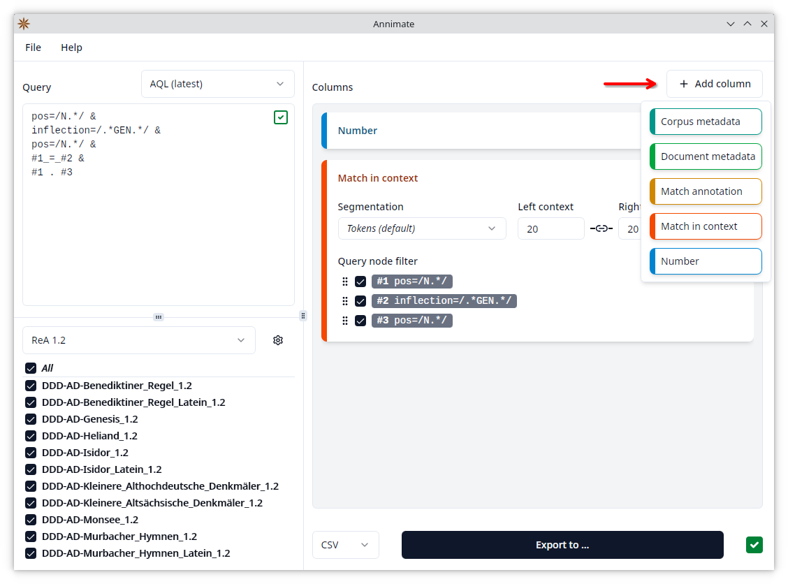
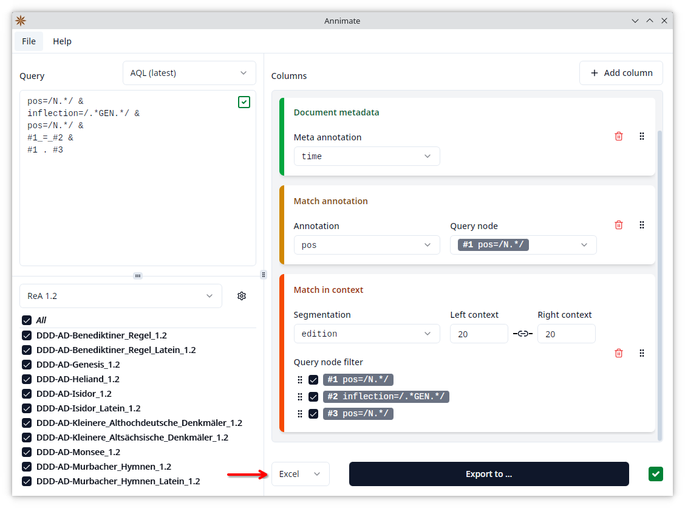
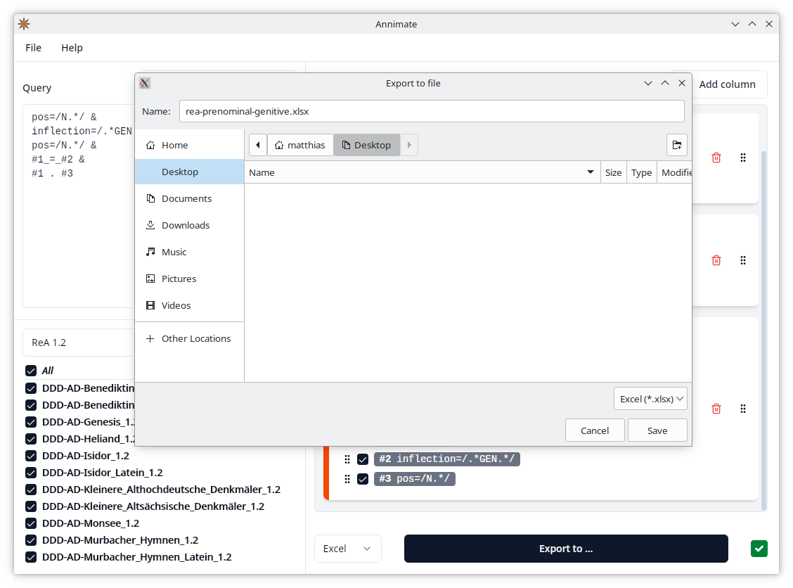
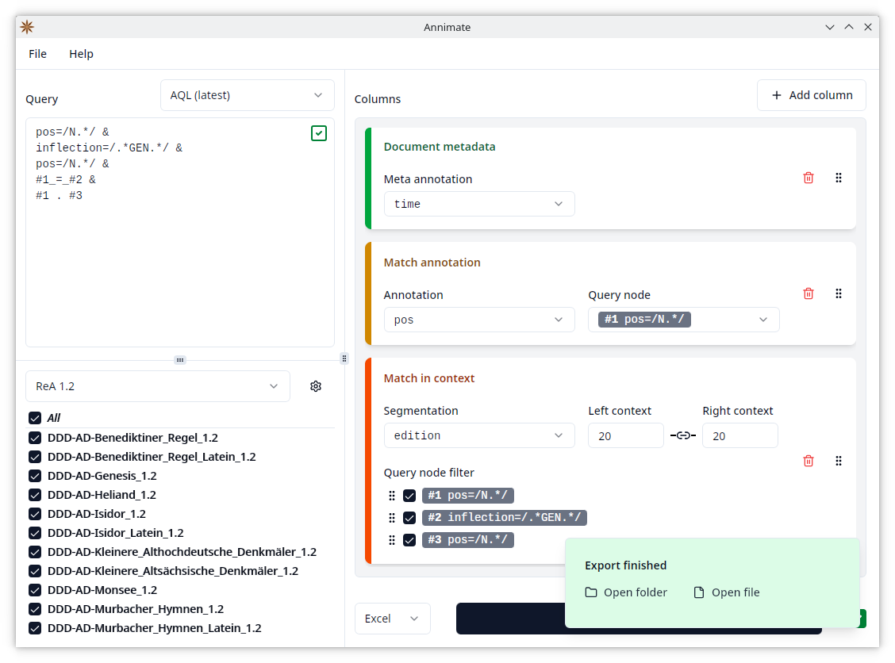

# Exporting Query Results

### Selecting Corpora

When you want to export query results, the first step is to select which corpora to query. On the lower left of the Annimate main screen, you see a list of all corpora that you have previously imported, and you can click on the checkbox next to each corpus in order to include it in the query. As a shortcut, you can click on the checkbox next to "All" to select all corpora in the list.

You can also select a corpus set in order to show only the corpora that are part of the set. The most common workflow is to first select a corpus set and then click on the checkbox next to "All" to select all corpora of the selected set.

### Entering the Query

The next step is to enter a query in the _ANNIS Query Language (AQL)_ on the upper left. See the corresponding section in the [ANNIS User Guide](https://korpling.github.io/ANNIS/4.0/user-guide/aql/index.html) for details on AQL.

> **Note:** If there is an ANNIS installation available for your corpora, you may want to draft your query there, using ANNIS to visualize the results, and then copy-paste it into Annimate for the export. You can, of course, also type your query directly into Annimate.

If the query is valid (in the context of the selected corpora), you see a green checkmark in the corner of the query area:

If the query is invalid, you see a red "x" icon. Hover over the icon with your mouse to see the error message. You can also click on the icon to make Annimate select the part of the query that the error message refers to:

Note that directly above the query area, you can select between two different versions of the ANNIS Query Language:

- **AQL (latest)**: the current version of AQL used in ANNIS starting from version 4
- **AQL (compatibility mode)**: the previous version of AQL used in ANNIS before version 4

The distinction between these two versions needs to be made because the same query may yield different results depending on which version you select, and a query may be valid in one version, but invalid in the other. For a detailed list of differences between the two, see [Differences in Compatibility Mode](https://korpling.github.io/ANNIS/4.0/user-guide/aql/compatibility-mode.html) in the ANNIS User Guide.

In general, you should always select "AQL (latest)" unless you need compatibility with an installation of e.g. ANNIS 3. The most common case where a query is valid in compatibility mode, but invalid in the latest version, is when it uses a `meta::` condition, e.g. to restrict matches to a specific document:

While it is possible to select "AQL (compatibility mode)" to support such queries, it is recommended to select "AQL (latest)" and replace the `meta::` condition with the "part of" operator `@*`:

### Configuring Table Columns

Since the query results will be exported as a table (either in CSV or Excel format), the next step is to define what columns the table should contain. This depends on what type of data about the matches you are interested in.

The right-hand side of the Annimate main screen shows a list of all columns that are currently configured.

By default, there are two entries, one of type "Number" and one of type "Match in context". You can manipulate this list in the following ways:

- Click on the  button of an entry to remove it.
- Click on the  button of an entry and then drag it up or down to reorder the entries.
- Click on the "Add column" button and select a column type to add a new entry:
  

The following column types are available. For details on each column type, refer to the corresponding section.

- [Number](columns/number.md)
- [Match in context](columns/match-in-context.md)
- [Match annotation](columns/match-annotation.md)
- [Corpus/document metadata](columns/metadata.md)

> **Note:** While each entry of the list will usually produce exactly one column, an entry of type "Match in context" will actually produce _multiple_ columns. See [Match in context](columns/match-in-context.md) for details.

### Selecting the Format and Starting the Export

On the lower right of the Annimate main screen, you can choose between one of two formats for the export:

- **CSV**: This produces a `.csv` file containing a table in the _Comma-Separated Values_ format. This format is not specific to any particular software and can be imported into all spreadsheet tools (including Microsoft Excel) or even opened with a text editor.
- **Excel**: This produces a `.xlsx` file containing an Excel workbook. Since it doesn't make use of advanced features of Microsoft Excel, it can also be opened with most other spreadsheet tools such as [LibreOffice Calc](https://www.libreoffice.org/discover/calc/).

Finally, click on the "Export to ..." button and select a filename in order to start the export. If this button is disabled (grayed out), this means that the information needed to start the export is still incomplete. Make sure that the following conditions are satisfied:

- At least one corpus is selected.
- A query has been entered and is valid (showing a green checkmark).
- At least one column has been configured.
- All configured columns have all their fields set to a value (Segmentation, Left/right context, Annotation, Query node, Meta annotation)

> **Note:** If you change the selection of corpora and/or the query _after_ you have already configured the columns, it can happen that a previously selected option is no longer available (e.g. for "Query node" if you change the query so that the selected node no longer exists). Then the selection is cleared and the "Export to ..." button becomes disabled. In this case, go through the list of columns again and make sure that all fields are filled.

When the export is finished, you will see a notification with shortcuts to open the folder containing the file in your system's File Explorer or to open the file directly in the program associated with `.csv` respectively `.xlsx` files on your system.

### Working With Exported Data

#### CSV Files

The `.csv` files produced by Annimate are human-readable and can be opened with any text editor. In case you want to import them into a spreadsheet tool, make sure to use the following configuration for the tool (naming may vary depending on the tool):

- **Delimiter**: Comma
- **Includes header row**: Yes

In order to import a CSV file into Microsoft Excel, follow the steps in the [Excel documentation](https://support.microsoft.com/en-us/office/import-or-export-text-txt-or-csv-files-5250ac4c-663c-47ce-937b-339e391393ba). We recommend the approach documented under "Import a text file by connecting to it" (not "Import a text file by opening it in Excel") since it gives you more control over how Excel interprets the data.

#### Excel Files

The `.xlsx` files produced by Annimate can be opened directly in Microsoft Excel or any other spreadsheet tool that supports the Excel file format. It contains two separate worksheets:

- **Data**: This contains the actual exported data. Note that it includes a header row, so the row number displayed by Excel is offset by one compared to the number of the match. In order to include the number of the match, add a ["Number" column](columns/number.md).
- **Information**: This contains some information about the export that helps you document and reproduce it:
  - The query
  - The query language: "AQL latest" or "AQL (compatibility mode)" as described above
  - The list of corpora
  - Which version of Annimate was used to produce the export

## What's Next?

In order to save and resume your work or collaborate with others, learn about [Working With Projects](projects.md).
