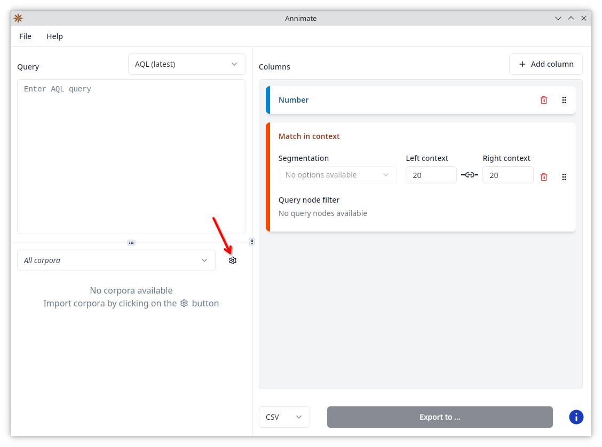
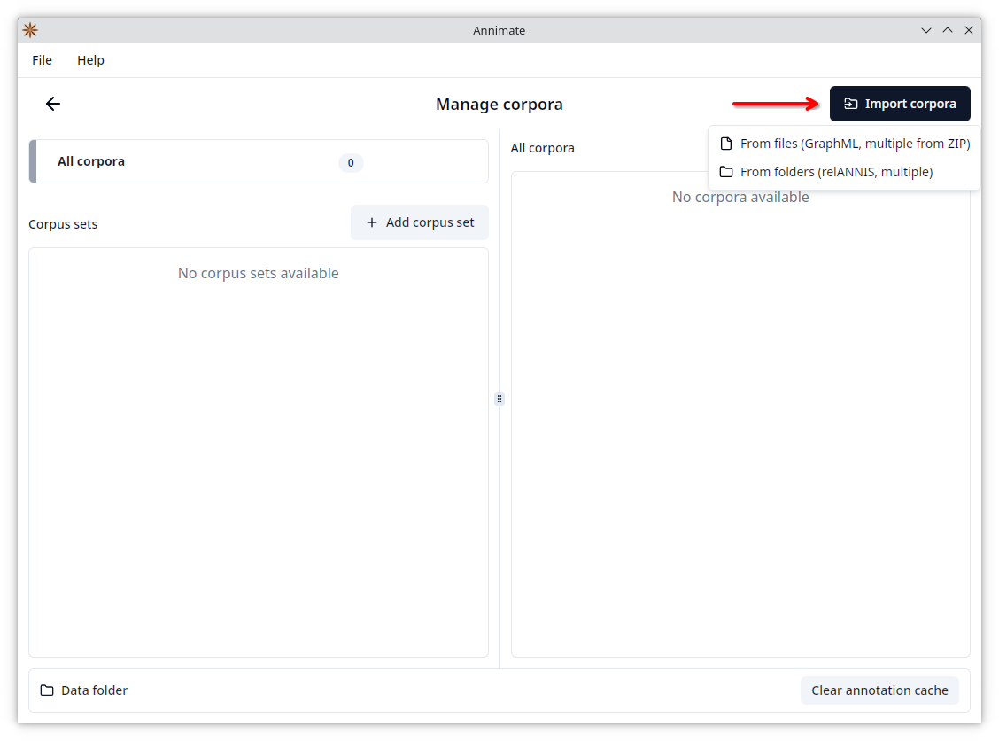
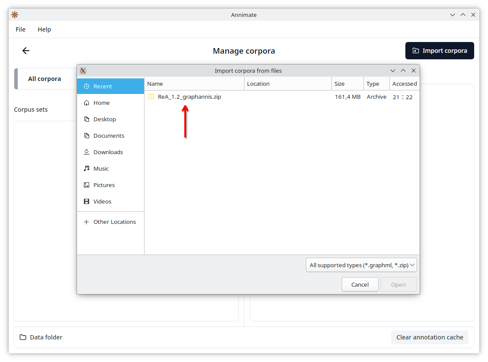
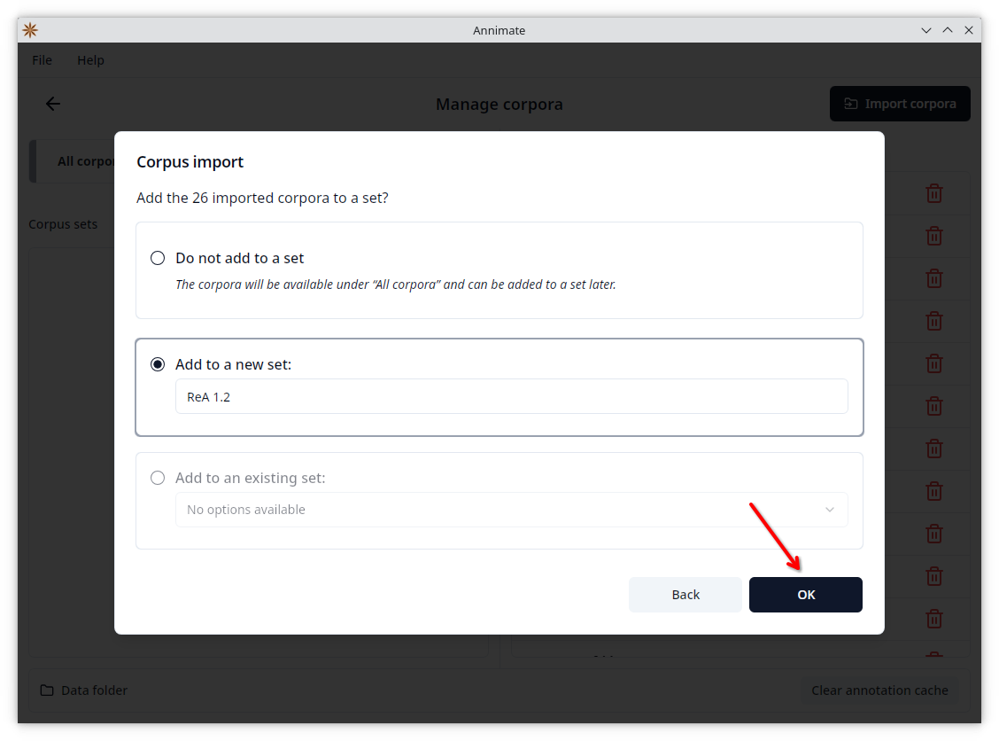
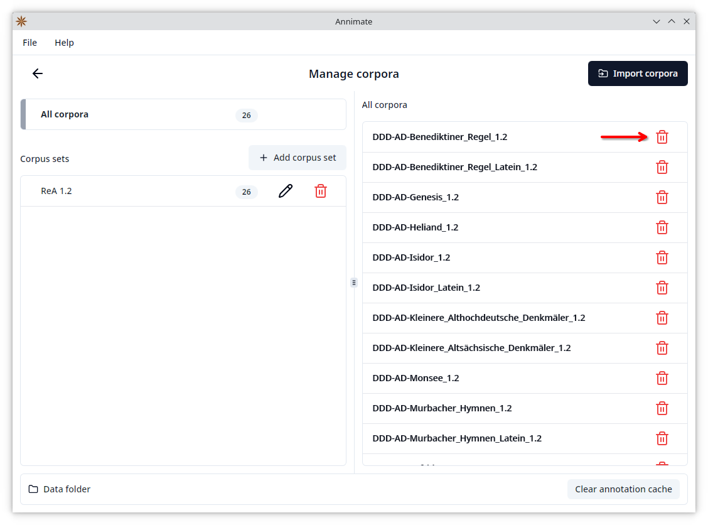
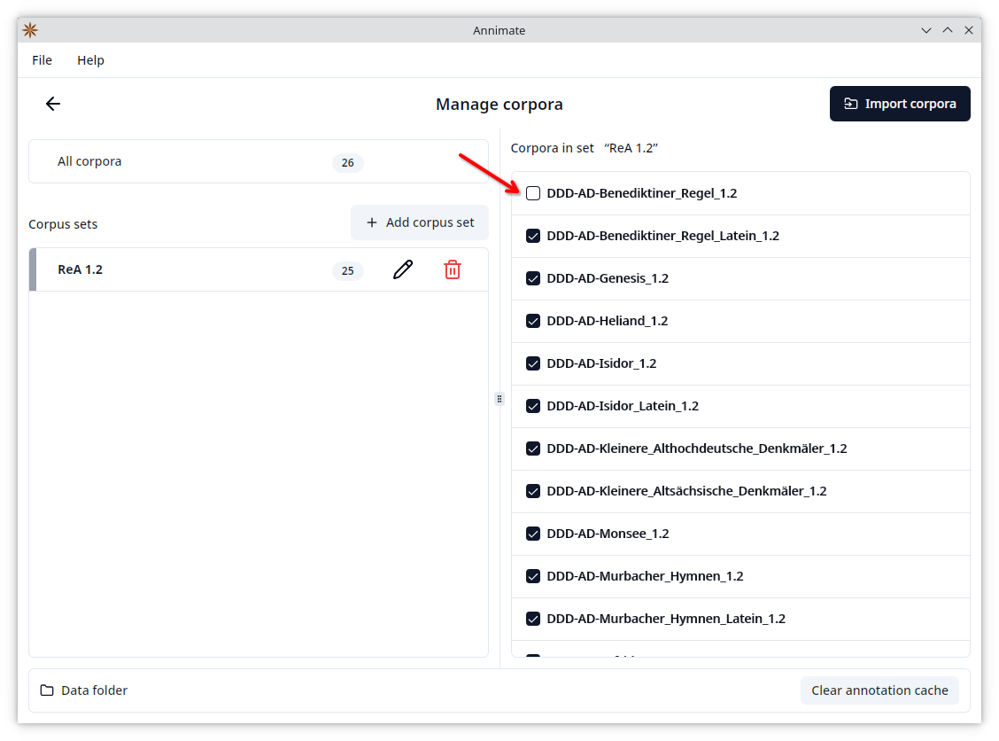
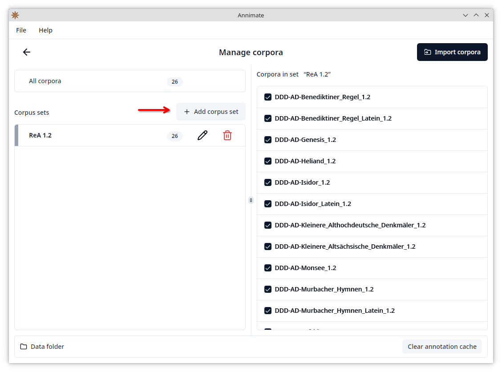
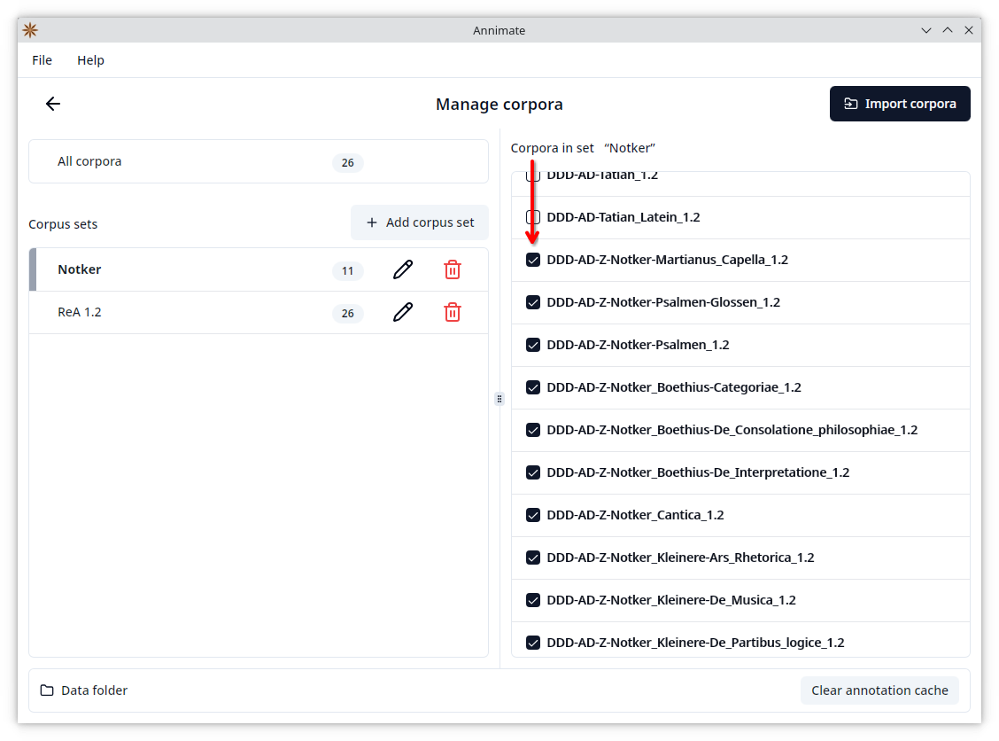
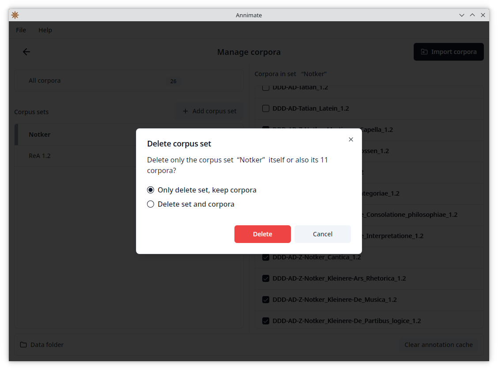
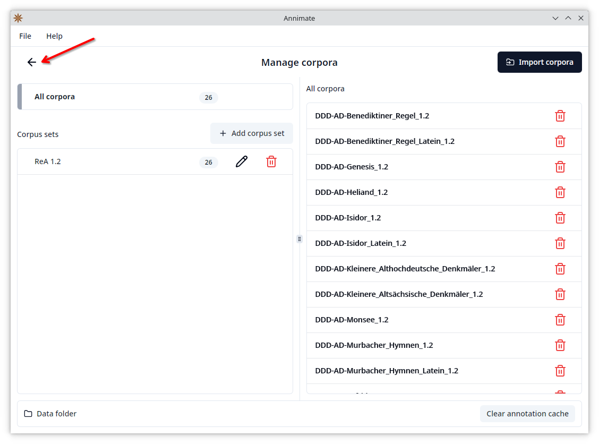

# Importing Corpus Data

Before you can run a query and export its results, you need to obtain corpus data for one or more corpora and import them into your installation of Annimate.

Note that there are different definitions of what constitutes a corpus, depending on the context. In this User Guide, we will use the _Referenzkorpus Altdeutsch (ReA) 1.2_ as an example. It consists of several parts:

```
ReA 1.2
├─ DDD-AD-Benediktiner_Regel_1.2
├─ DDD-AD-Benediktiner_Regel_Latein_1.2
├─ DDD-AD-Genesis_1.2
├─ DDD-AD-Heliand_1.2
├─ DDD-AD-Isidor_1.2
   ...
```

While one would commonly call the full ReA 1.2 a corpus, it's each individual part such as `DDD-AD-Benediktiner_Regel_1.2` that's called a _corpus_ in the context of ANNIS and Annimate. In order to keep all the corpora belonging e.g. to ReA 1.2 together as a group, Annimate supports organizing corpora in _corpus sets_ as described below.

> **Note:** In this User Guide, we mostly follow this convention of referring to each individual part as a corpus. However, we sometimes use the same term for a corpus in the conventional sense (e.g. ReA) where it's convenient and unlikely to cause confusion.

### Obtaining Corpus Data

Corpora are distributed in many different data formats, two of which a related to ANNIS and are supported by Annimate:

- **graphANNIS/GraphML**: This is the graph-based format used internally by ANNIS. In this format, each corpus comes as a single `.graphml` file.
- **relANNIS**: This is the relational format that was previously used by ANNIS but is still used to distribute many corpora. In this format, each corpus comes as a folder containing multiple files with fixed names such as `corpus.tab` or `node.tab`.

Annimate can import corpora in both of these formats. It can also import (potentially nested) folders or ZIP files containing one or more corpora in either of these formats.

There are several ways to obtain corpus data:

- Download the data from a public repository such as [LAUDATIO](https://www.laudatio-repository.org/): In the "Download" menu for each corpus (here in the sense of a corpus set such as ReA), you find a list of the formats in which the data are available. Select `graphannis` or `relannis` if available. The downloaded ZIP file can be imported directly into Annimate.
- If the corpus is available in a linguistic format different from graphANNIS or relANNIS, you may be able to convert it into one of the two supported formats using a conversion tool such as [Pepper](https://corpus-tools.org/pepper/) or [Annatto](https://github.com/korpling/annatto):
  - For Pepper, select the [`ANNISExporter`](https://github.com/korpling/pepperModules-ANNISModules/tree/master#usage) in the export step to convert the corpus into the relANNIS format.
  - For Annatto, use the [`graphml`](https://github.com/korpling/annatto/blob/main/docs/exporters/graphml.md) exporter to convert the corpus into the graphANNIS/GraphML format.
- If the corpus is accessible through a public installation of ANNIS, ask the maintainers of the installation to provide the data.

> **Note:** See the [Links](links.md#corpora) section for download links for some publicly available corpora.

### Importing Into Annimate

1. In Annimate, click on the  button to reach the "Manage corpora" screen.
   
2. Click on "Import corpora", then select whether you want to import one or more files (for GraphML or ZIP files) or one or more folders (for relANNIS corpora or to import multiple corpora from one or more folders).
   
3. Select one or more files/folders to import.
   
4. Wait until the import is finished, then click on "Continue".
   
5. In the final step you can optionally add all imported corpora to a (new or existing) corpus set. Click on "OK" to finish the import.
   

> **Note:** It is _not_ possible to keep two corpora of the same name imported at the same time. If you try to import a corpus with the same name as a corpus that was previously imported, the import will fail. This is true even if the old and new corpora are added to different sets.
>
> A common case where this can happen is when there are multiple versions of a corpus, and the version numbers are not included in the corpus names. In this case, when an older version has already been imported, you cannot just import the newer version, because it has the same name. Instead, you first need to delete the older version (see below) before you can import the newer version.

### Organizing Corpora and Corpus Sets

While you can add corpora to sets directly when they are imported, it is also possible to organize corpus sets at any time on the "Manage corpora" screen.

On the left-hand side, you can either select "All corpora" or a specific corpus set:

- When "All corpora" is selected, the right-hand side shows a list of all corpora. Here you can delete an individual corpus by clicking on the corresponding  button and then clicking on "Delete" in the following dialog. The corpus will be deleted and removed from all sets.
  
- When a specific corpus set is selected, the right-hand side shows a list of all corpora with checkboxes, where the corpora belonging to the selected set are checked. Check or uncheck a corpus in order to add or remove it from the selected set, respectively.
  

In order to create a new corpus set, click on the "Add corpus set" button, enter a name, and click on "OK":

Then check all corpora that you want to add to the set:


You can also rename a set by clicking on the corresponding  button or delete it by clicking on the corresponding  button. When deleting a set, you can choose whether to only delete the set itself (keeping the corpora available under "All corpora" and in other sets they may be a part of), or to also delete all corpora of the set:


Click on the  button to go back to the Annimate main screen.


## What's Next?

After you have successfully imported your corpus data, you can proceed with [Exporting Query Results](export.md).
