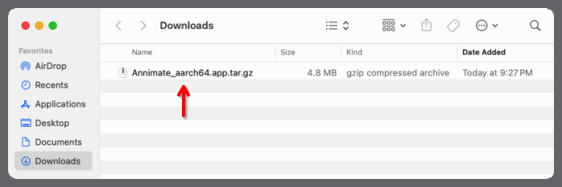
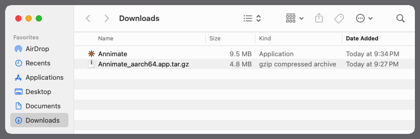
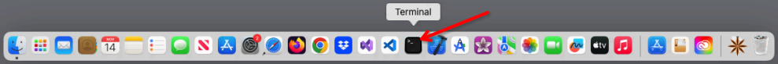
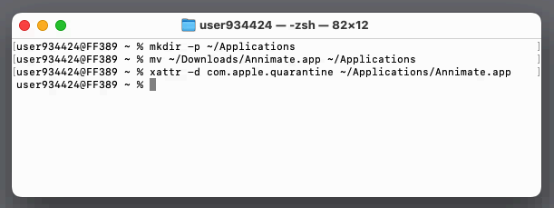
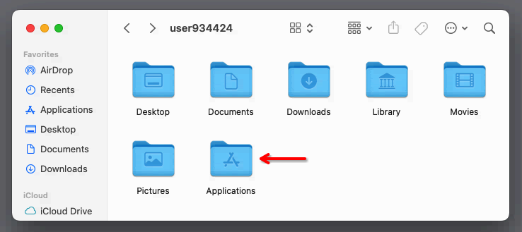
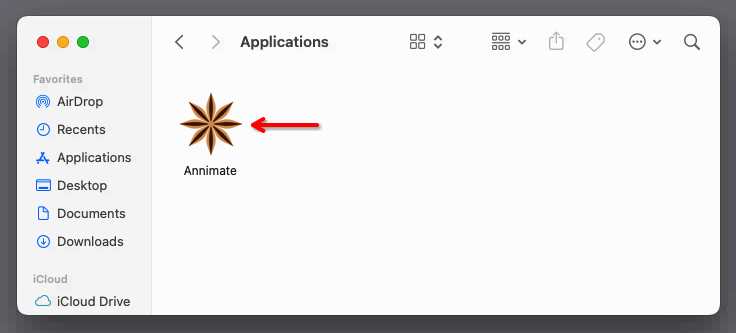
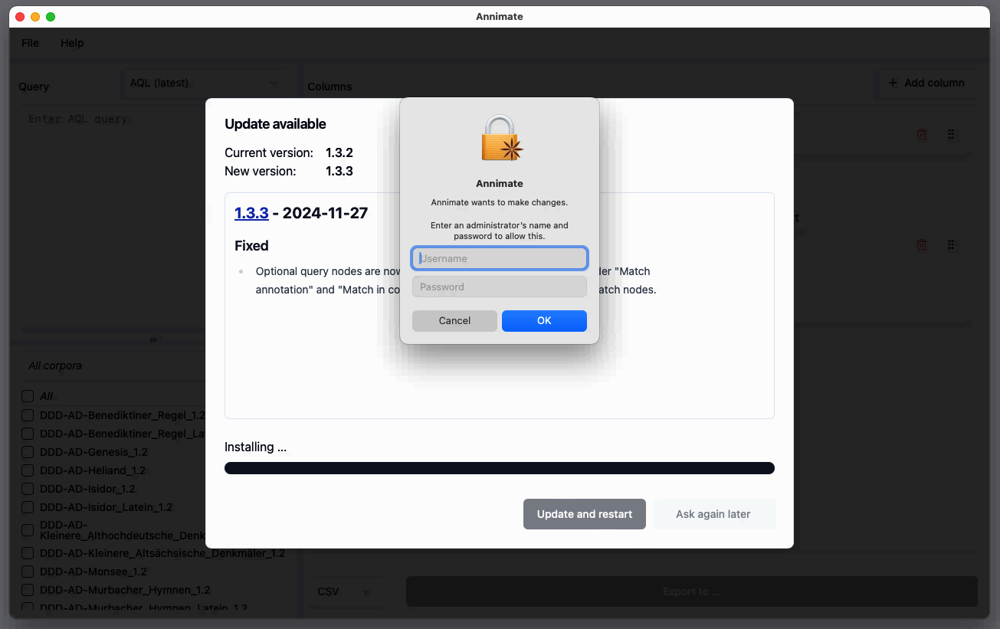

# Installation

Since Annimate is a desktop-based application (as opposed to a website), you need to install it on your local system before you can use it.

The exact procedure depends on the operating system you are using. Annimate is currently available for Windows, Linux and macOS.

## Windows

On Windows, Annimate comes with an installer that takes care of the installation process for you and can update your installation automatically whenever a new version of Annimate becomes available.

> **Note:** Installing Annimate on Windows does _not_ require administrator permissions. However, Annimate will only be installed for the current user, not system-wide.

In order to install Annimate, go through the following steps:

1. Download the installer `.exe` file from GitHub: [Annimate_1.3.3_x64-setup.exe][1]
2. Run the downloaded `.exe` file and follow the instructions of the installation wizard
3. Afterwards, you can run Annimate through the Windows start menu entry and/or the link on your desktop, depending on the options you chose in the installation wizard

### Automatic updates

Every time Annimate is started, it automatically checks for updates in the background. If there is an update, you are presented with a dialog telling you that an update is available and listing the most important changes. You can then choose to either

- apply the update, or
- skip the update for now.

If you choose to apply the update, the application will restart itself when the installation is completed. If you choose to skip the update, you will be reminded again the next time you start the application.

> **Note:** We strongly recommend that you install updates in order to keep up with new features and bugfixes.

## Linux

On Linux, Annimate comes in two different formats that you can choose from: an [AppImage](https://appimage.org/) and a [Debian package](<https://en.wikipedia.org/wiki/Deb_(file_format)>).

### AppImage

The Annimate AppImage is a self-contained application bundle that includes all of its dependencies pre-bundled and runs on all common Linux distributions such as Ubuntu, Debian, openSUSE, RHEL, CentOS and Fedora without requiring a dedicated installation step. It can update itself automatically whenever a new version of Annimate becomes available.

In order to use the AppImage, go through the following steps:

1. Download the `.AppImage` file from GitHub: [Annimate_1.3.3_amd64.AppImage][2]
2. Make it executable:
   ```shell
   chmod a+x Annimate*.AppImage
   ```
3. Afterwards, you can run Annimate by running the `.AppImage` file:
   ```shell
    ./Annimate*.AppImage
   ```

#### Automatic updates

Every time Annimate is started, it automatically checks for updates in the background. If there is an update, you are presented with a dialog telling you that an update is available and listing the most important changes. You can then choose to either

- apply the update, or
- skip the update for now.

If you choose to apply the update, the application will restart itself afterwards. If you choose to skip the update, you will be reminded again the next time you start the application.

> **Note:** We strongly recommend that you install updates in order to keep up with new features and bugfixes.

Since there is no dedicated installation step, updating in this case just means that the `.AppImage` file is replaced with a newly downloaded one. Note that the name of the `.AppImage` file (which includes a version number) stays the same, even though it now contains a newer version. If you want to avoid this, consider renaming the file to give it a version-independent name.

### Debian Package

On Debian and its derivatives (such as Ubuntu), you can alternatively install Annimate from a Debian package. Note that this requires `sudo` privileges and does _not_ support automatic updates.

In order to install the Debian package, go through the following steps:

1. Download the `.deb` file from GitHub: [Annimate_1.3.3_amd64.deb][3]
2. Install it:
   ```shell
   sudo dpkg -i ./Annimate_*_amd64.deb
   ```
3. Start Annimate:
   ```shell
   Annimate
   ```

## macOS

On macOS, Annimate comes as a macOS Application Bundle (`.app` file) packaged in a `.tar.gz` archive. It can update itself automatically whenever a new version of Annimate becomes available.

There are two different versions of the Application Bundle for different types of processors:

- Apple silicon processors (for newer Mac computers, starting from late 2020)
- Intel processors (for older Mac computers)

Check the [Apple Support](https://support.apple.com/en-us/116943) to find out which type of processor you have. Annimate requires a macOS version of 10.13 "High Sierra" or newer.

> **Note:** As the Annimate Application Bundle is not signed by Apple, your system will set a "quarantine" attribute for the downloaded file. You will need to remove this attribute as described below. Otherwise you will see a message saying that "Annimate is damaged and can't be opened" when trying to start it.

In order to install Annimate, go through the following steps:

1. Download the `.tar.gz` file from GitHub:
   - [Annimate_aarch64.app.tar.gz][4] for Apple silicon processors
   - [Annimate_x64.app.tar.gz][5] for Intel processors
2. Double-click on the `.tar.gz` file in your `Downloads` folder to extract it:
   

   This will produce an `Annimate` Application Bundle:

   

3. Move the `Annimate` Application Bundle to one of the following folders:

   - To install it only for the current user (does _not_ require administrator permissions): Move it to a subfolder of your home directory such as `~/Applications`. You may have to create this folder first in case it does not exist yet.
   - To install it system-wide (requires administrator permissions): Move it to the system-wide `/Applications` folder.

4. Open a terminal by clicking on the "Terminal" icon in your Dock:
   

5. In the terminal, go into the folder containing the `Annimate` Application Bundle (`Annimate.app` file) and run the following command to remove the quarantine attribute:

   ```shell
   xattr -d com.apple.quarantine Annimate.app
   ```

   The following screenshot shows a terminal session where the file is moved from the `Downloads` folder to the (newly created) `~/Applications` folder and the quarantine attribute is removed:

   

6. Afterwards you can run Annimate by navigating to the installation folder (here: `~/Applications`) and double-clicking on the `Annimate` app icon:

   
   

#### Automatic updates

Every time Annimate is started, it automatically checks for updates in the background. If there is an update, you are presented with a dialog telling you that an update is available and listing the most important changes. You can then choose to either

- apply the update, or
- skip the update for now.

If you choose to apply the update, the application will restart itself afterwards. If you choose to skip the update, you will be reminded again the next time you start the application.

> **Note:** We strongly recommend that you install updates in order to keep up with new features and bugfixes.

In case Annimate is installed in a folder that requires administrator permissions, you are prompted to enter your administrator credentials:



## Obtaining Older Versions

For reference, you can find the most recent and all previous releases of Annimate on the [Releases](https://github.com/matthias-stemmler/annimate/releases) page on GitHub.

[1]: https://github.com/matthias-stemmler/annimate/releases/download/v1.3.3/Annimate_1.3.3_x64-setup.exe
[2]: https://github.com/matthias-stemmler/annimate/releases/download/v1.3.3/Annimate_1.3.3_amd64.AppImage
[3]: https://github.com/matthias-stemmler/annimate/releases/download/v1.3.3/Annimate_1.3.3_amd64.deb
[4]: https://github.com/matthias-stemmler/annimate/releases/download/v1.3.3/Annimate_aarch64.app.tar.gz
[5]: https://github.com/matthias-stemmler/annimate/releases/download/v1.3.3/Annimate_x64.app.tar.gz

## What's Next?

After you have successfully installed Annimate, you can proceed with [Importing Corpus Data](import.md).
