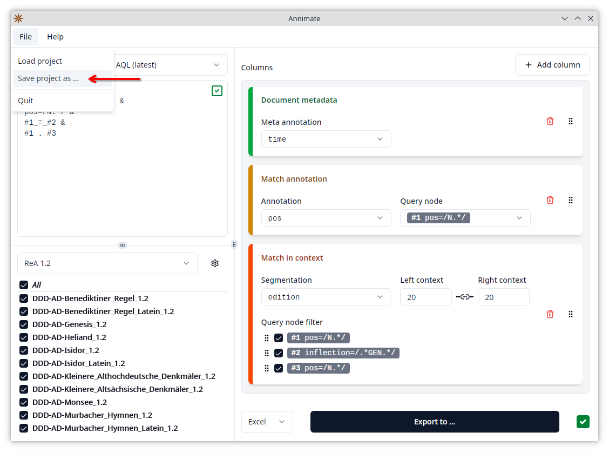
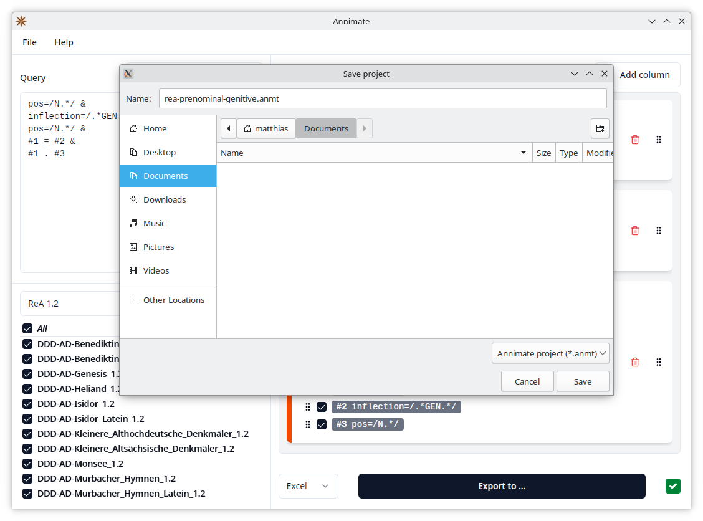
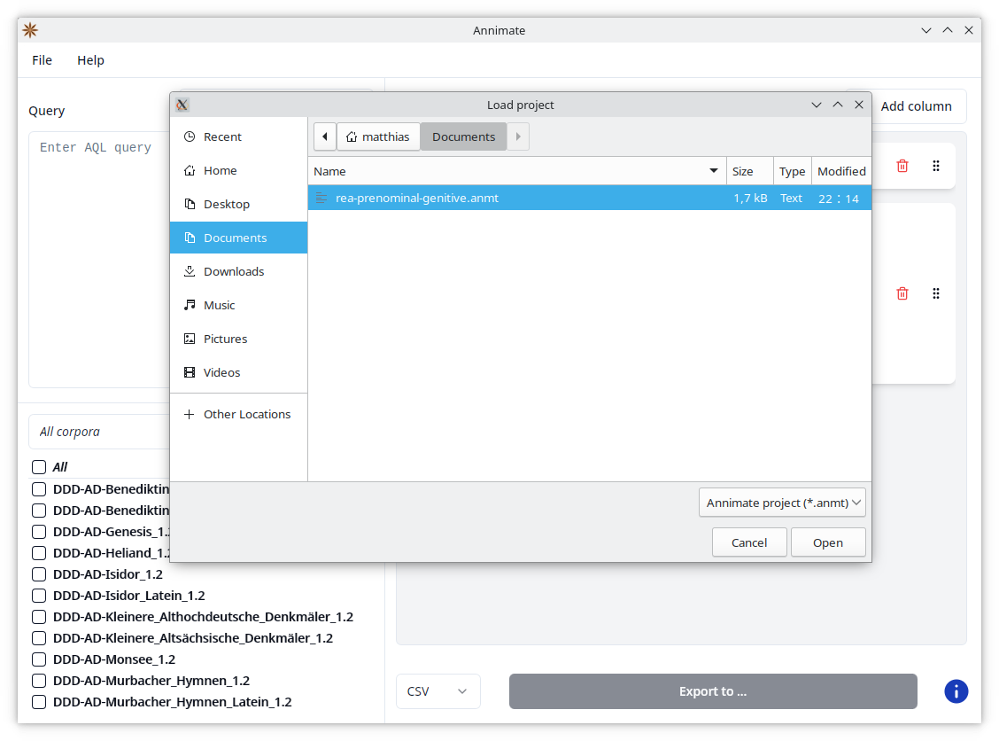
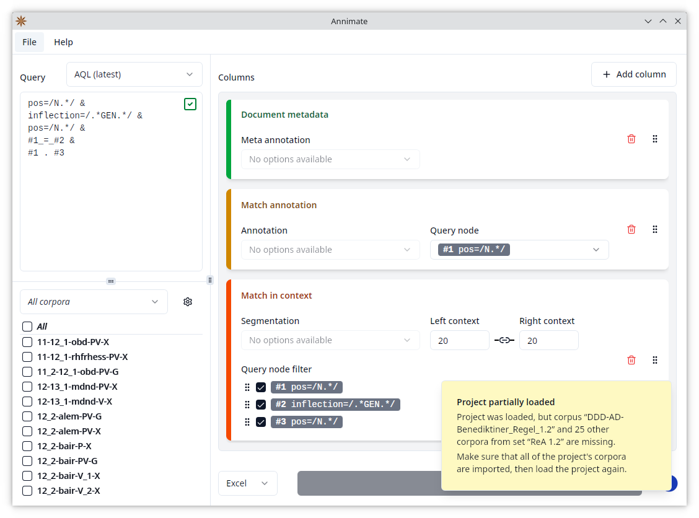

# Working With Projects

Since exporting query results requires you to configure quite a few parameters as explained in the [previous chapter](export.md), you may want to save this configuration and load it back into Annimate later. This can be useful in several cases:

1. You want to save the current state of your work, so that you can come back to it later.
2. You want to document your work for later reference.
3. You want to enable others to reproduce or collaborate on your work.

Annimate supports all of these scenarios through a feature called _projects_. A _project file_ is a file with the `.anmt` extension that contains a snapshot of an Annimate configuration. You can save your current configuration as a project file and load a configuration from an existing project file into Annimate.

## Saving a Project

You can save your current configuration as a project file as follows:

1. Click on "File", then select "Save project as ...".

2. Select a filename for your project.

The following parameters will be saved if available:

- The selected corpus set
- The selected corpora
- The entered query
- The selected version of the ANNIS Query Language: AQL (latest) or AQL (compatibility mode)
- The configured table columns including all selected parameters such as annotations
- The selected export format: CSV or Excel

Note that you can save your current configuration in any state, regardless of whether it is valid for export or not.

## Loading a Project

You can load a configuration from an existing project file into Annimate as follows:

1. Click on "File", then select "Load project".

2. Select an existing project file.

This will load all of the parameters listed above into Annimate.

Loading a project will discard your current configuration. In order to keep it for later use, make sure to save it to another project file first.

> **Note:** While a project file contains all of the parameters necessary for exporting query results, it does _not_ include the actual corpus data.
> If you load a project referencing a corpus that does not exist in your installation of Annimate, you will see a warning message and only those corpora that _do_ exist are selected. Note that this can lead to a state where some parameter selections included in the project file are not visible, for instance when the project file references an annotation (as part of a configured table column) that does not exist in the selected corpora.
>
> 

## File Format

Annimate project files use the `.anmt` file extension. While their main purpose is to be loaded into Annimate, they can also be opened using any standard text editor. The file format is human-readable and mostly self explaining, so that project files can be used for documentation purposes even when an installation of Annimate is not available.

> **Technical Note:** Annimate project files currently use the [TOML](https://toml.io/en/) file format. The details of the format are not guaranteed to remain stable across different versions of Annimate, but future versions will be backward compatible in the sense that they will still be able to read older project files.
>
> The file format is deterministic, i.e. saving the same state twice produces identical files. This makes project files suitable for checking them into version control systems such as [Git](https://git-scm.com/).

## What's Next?

Have fun with Annimate! If you encounter any problems, check out the [Troubleshooting](troubleshooting.md) section. [Let us know](https://github.com/matthias-stemmler/annimate/issues/new/choose) in case you need support.
