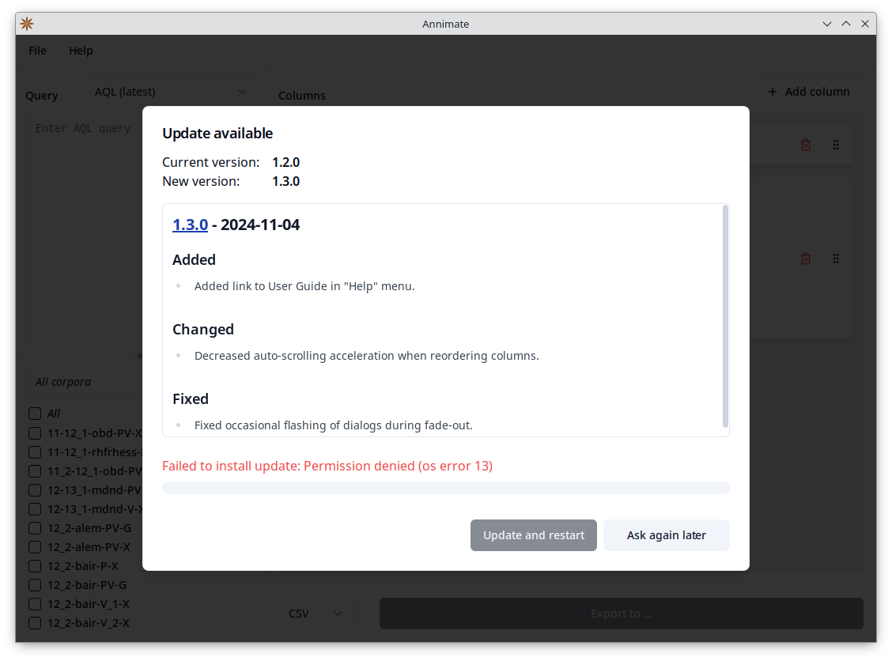

# Troubleshooting

This is a collection of common issues you might encounter while using Annimate. If you cannot find a solution to your problem here, feel free to [file an issue](https://github.com/matthias-stemmler/annimate/issues/new/choose) on GitHub.

## Installation

### On macOS, there is an error message saying that Annimate is damaged

If you see an error message like this when trying to start Annimate on macOS:


this is because Annimate has not been signed by Apple.

To fix this, make sure that you remove the "quarantine" attribute as described in the [Installation](installation.md#macos) section.

### There is a "permission denied" error when trying to install an update

If you see an error message like this when Annimate tries to install an update (instead of `os error 13`, it could also show `os error 1`):



this is because Annimate has no write permissions on its executable file.

This mostly happens on macOS if Annimate is installed into a folder such as `/Applications` that requires administrator permissions or in a protected folder such as `Desktop`, `Documents` or `Downloads` in the home directory. To fix this, make sure to install Annimate into a non-protected folder as described in the [Installation](installation.md#macos) section.

It can also happen on Linux if the current user has no permission to write to the folder containing the Annimate AppImage. To fix this, you may assign the necessary permissions by running

```shell
chmod u+w <folder containing the .appimage file>
```

In any case, instead of letting Annimate update itself, you can alternatively just download and install/run the latest release.

> **Note:** Your imported corpora are persisted across updates and will _not_ be lost even if you install a newer version manually.

## Exporting Query Results

### Match in context: Desired segmentation is not listed

If your desired segmentation layer is not listed under "Segmentation" in a [Match in context](columns/match-in-context.md) box, this may be because not all of the selected corpora contain the segmentation. You can confirm this by selecting just a single corpus (try different ones from the list) and checking if the segmentation appears.

To fix this, you may want to group your corpora differently, so that all corpora in a set contain the same segmentations. Alternatively, you can use different segmentations for different subsets of corpora by doing separate exports.

### Match in context: Columns are empty

If the [Match in context](columns/match-in-context.md) columns in your CSV or Excel file are empty, this may be because you selected the _Tokens (default)_ segmentation, but your corpus uses _virtual tokens_. This means that the segmentation nodes on the token layer do not have any textual content (hence the empty columns), but just serve the purpose of aligning other segmentation layers.

To fix this, try to choose an option different from _Tokens (default)_ under "Segmentation". If there is no other option, check out the [previous point](#match-in-context-desired-segmentation-is-not-listed).

### Corpus/document metadata: Column is empty

If a [Corpus/document metadata](columns/metadata.md) column in your CSV or Excel file is empty, this may be because the selected meta annotation is present on a different level than you configured. For instance, you may have configured a "Document metadata" column, but the selected annotation may actually be present at the corpus level.

To fix this, add both a "Corpus metadata" and a "Document metadata" column for the same annotation and check if you get any data in either column. You may even get data in one column for some matches and in the other column for other matches, as explained in the Note in [Corpus/document metadata](columns/metadata.md).

### The "Export to ..." button is disabled

If the "Export to ..." button is disabled (grayed out), this means that the information needed to start the export is still incomplete.

To fix this, make sure that the following conditions are satisfied:

- At least one corpus is selected.
- A query has been entered and is valid (showing a green checkmark).
- At least one column has been configured.
- All configured columns have all their fields set to a value (Segmentation, Left/right context, Annotation, Query node, Meta annotation)

> **Note:** If you change the selection of corpora and/or the query _after_ you have already configured the columns, it can happen that a previously selected option is no longer available (e.g. for "Query node" if you change the query so that the selected node no longer exists). Then the selection is cleared and the "Export to ..." button becomes disabled. In this case, go through the list of columns again and make sure that all fields are filled.
